# Project Report: Chrono-Aware Embryo Phase Classification via a Hybrid Ordinal Regression Loss

## Abstract
We study a 16-class embryo development phase classification problem using time-lapse imagery, where labels are **naturally ordered in time** (from `tPB2` to `tHB`). Standard neural classifiers optimize categorical accuracy but are *chronologically blind*: they penalize all misclassifications equally regardless of temporal distance. To incorporate temporal structure, we propose a **Hybrid Ordinal Regression Loss** that blends (i) standard cross-entropy for exact classification with (ii) a mean-squared error penalty between the true class index and the **expected class index** under the model’s softmax distribution. We conduct an ablation “tournament” across MobileNet_v2, GoogLeNet, Inception_v3, VGG16, and VGG19, comparing Baseline CE ($\alpha=1.0$) against the Hybrid loss ($\alpha=0.5$). Empirically, **InceptionV3 with Baseline CE** achieved the best validation performance (Tolerance Accuracy ±1 phase: **89.42%**, Exact Accuracy: **67.00%**). The Hybrid objective acted as a strong regularizer (reduced train–val gaps), but also introduced a gradient conflict that often reduced exact accuracy and increased training loss, consistent with models adopting conservative “middle-ground” predictions to avoid large squared-distance penalties.

## 1. Introduction
### 1.1 Motivation
Embryo morphokinetics are inherently sequential: phase `t4` occurs after `t3`, and confusing adjacent phases is typically less severe than confusing distant phases (e.g., `tPB2` vs `tHB`). However, conventional deep classifiers trained with cross-entropy treat the class set as unordered categories. This can lead to decision boundaries that ignore temporal proximity and fail to encourage *ordinally consistent* predictions.

### 1.2 Objective
We aim to improve chronological awareness in deep image classifiers **without changing the model architectures** by modifying the loss function. Specifically, we test whether adding an ordinal distance penalty improves tolerance-based performance and mitigates overfitting.

### 1.3 Contributions
- A simple, differentiable **expected-index** formulation that maps a softmax distribution to a continuous timeline estimate.
- A **hybrid loss** combining categorical accuracy (CE) with an ordinal distance penalty (MSE).
- A controlled ablation study across five standard CNN backbones, trained twice each (Baseline vs Hybrid).

## 2. Mathematical Formulation
Let $K=16$ be the number of embryo phases, indexed $i \in \{0,\dots,15\}$. For an input image $x$, the network outputs logits $\mathbf{z}(x) \in \mathbb{R}^K$, and the class probabilities are

$$
\mathbf{p} = \text{softmax}(\mathbf{z}), \quad p_i = \frac{\exp(z_i)}{\sum_{j=0}^{K-1} \exp(z_j)}.
$$

### 2.1 Baseline Cross-Entropy
For ground-truth class index $y$:

$$
\mathcal{L}_{\text{CE}} = -\log p_y.
$$

This objective optimizes exact classification likelihood but encodes no notion of ordinal distance.

### 2.2 Expected Phase Index
We define a continuous-valued timeline estimate using the expected value of the softmax distribution:

$$
\mathbb{E}[\hat{y}] = \sum_{i=0}^{K-1} p_i \cdot i.
$$

This quantity is differentiable w.r.t. logits and encourages probability mass to move toward the correct temporal neighborhood.

### 2.3 Ordinal Distance Penalty (MSE)
We penalize squared deviation between the expected index and the true index:

$$
\mathcal{L}_{\text{MSE}} = \big(\mathbb{E}[\hat{y}] - y\big)^2.
$$

Interpretation: a 1-phase error yields penalty $1$, while a 10-phase error yields penalty $100$, generating a strong force against chronologically distant predictions.

### 2.4 Final Hybrid Objective
We combine the two losses:

$$
\mathcal{L}_{\text{Hybrid}} = \alpha\,\mathcal{L}_{\text{CE}} + (1-\alpha)\,\mathcal{L}_{\text{MSE}}.
$$

In the ablation:
- Baseline CE uses $\alpha=1.0$.
- Hybrid loss uses $\alpha=0.5$.

## 3. Experimental Setup
### 3.1 Data and Task
- **Task:** 16-class embryo phase classification (`tPB2` to `tHB`).
- **Data format:** time-lapse images with per-video phase annotations.
- **Split:** 70/15/15 partition performed at the **video level** (to avoid leakage across frames from the same embryo).

### 3.2 Architectures
We compare five common CNN backbones:
- MobileNet_v2
- GoogLeNet
- Inception_v3
- VGG16
- VGG19

### 3.3 Preprocessing and Augmentation
- Images resized to the network input size.
  - **This run:** `299×299` for all backbones (a single resize setting aligned with Inception v3)
- Common augmentations (as used in the experiment notebook): random flips, rotations, normalization.

### 3.4 Training Protocol
Each architecture is trained twice:
- **Baseline:** CE-only ($\alpha=1.0$)
- **Hybrid:** CE + expected-index MSE ($\alpha=0.5$)

Model checkpoints and diagnostic plots are saved to `outputs/`.

## 4. Empirical Results
### 4.1 Tournament Dashboard
The consolidated dashboard summarizes tolerance accuracy, overfitting gap, exact accuracy, and final loss.

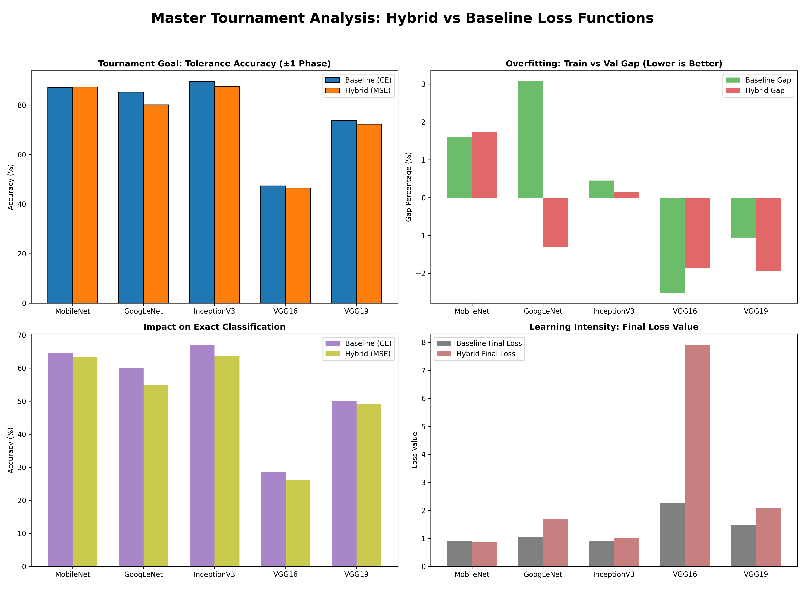

### 4.2 Quantitative Summary from Checkpoints
The metrics below are computed directly from the saved `.pth` checkpoints in `outputs/` (script: `tools/summarize_tournament.py`).

| Model | Run | Best Val Exact (%) | Best Val Tol (±1) (%) | Overfit Gap (Train–Val, pp) | Final Train Loss | Epochs |
|---|---|---:|---:|---:|---:|---:|
| MobileNet | Baseline (CE) | 64.65 | 87.21 | 1.60 | 0.91 | 6 |
| MobileNet | Hybrid (50/50 CE+MSE) | 63.40 | 87.25 | 1.72 | 0.86 | 9 |
| GoogLeNet | Baseline (CE) | 60.08 | 85.20 | 3.08 | 1.04 | 10 |
| GoogLeNet | Hybrid (50/50 CE+MSE) | 54.76 | 80.08 | -1.30 | 1.70 | 10 |
| InceptionV3 | Baseline (CE) | **67.00** | **89.42** | 0.45 | 0.89 | 6 |
| InceptionV3 | Hybrid (50/50 CE+MSE) | 63.60 | 87.61 | 0.15 | 1.01 | 8 |
| VGG16 | Baseline (CE) | 28.66 | 47.35 | -2.51 | 2.27 | 10 |
| VGG16 | Hybrid (50/50 CE+MSE) | 26.10 | 46.45 | -1.86 | 7.90 | 10 |
| VGG19 | Baseline (CE) | 49.99 | 73.72 | -1.06 | 1.47 | 7 |
| VGG19 | Hybrid (50/50 CE+MSE) | 49.25 | 72.26 | -1.93 | 2.09 | 7 |

### 4.3 Champion and Baseline Strength
**InceptionV3 + Baseline CE** is the overall winner, achieving **89.42% tolerance (±1)** and **67.00% exact** validation accuracy. This indicates that a strong architecture with standard CE already captures substantial phase-discriminative structure.

### 4.4 Regularization Effect of the Hybrid Loss
Across several models, the Hybrid loss reduces overfitting as measured by the train–val exact accuracy gap. In some cases the gap becomes slightly negative (validation exact exceeding train exact at the final epoch), a pattern consistent with:
- stronger effective regularization,
- reduced memorization of training samples,
- and/or optimization difficulty that prevents fully fitting the training set.

This behavior matches the intended design: the MSE term discourages probability mass from drifting far away in ordinal space, acting as an additional constraint beyond categorical correctness.

### 4.5 Gradient Conflict and “Middle-Ground” Predictions
Despite being mathematically well-defined, the Hybrid objective can induce a **gradient conflict**:
- CE pushes probability mass toward the single correct class index.
- MSE pushes the *expected index* toward $y$, which can be satisfied by spreading mass across neighboring classes (or, in difficult cases, drifting toward conservative central indices).

Because squared error grows rapidly with distance, early training mistakes can create large MSE gradients. This can cause models to adopt a risk-averse strategy: predicting distributions whose expected index stays near the dataset’s central phases to avoid catastrophic penalties. Empirically this manifests as:
- reduced **exact accuracy** in many hybrid runs,
- increased **final training loss** in challenging architectures (notably **VGG16 + Hybrid**, where the final training loss is very large),
- and weaker improvements than anticipated despite reduced overfitting.

### 4.6 Architecture-Specific Behavior
- **MobileNet:** high-performing and stable, with similar tolerance accuracy under both objectives (≈87%). This suggests MobileNet is an efficient baseline for edge-lean deployments.
- **GoogLeNet:** hybrid training degraded both exact and tolerance accuracy, consistent with the hybrid objective being harder to optimize.
- **VGG16/VGG19:** underperformed strongly in this setup. VGG16 + Hybrid showed severe optimization difficulty (large training loss), aligning with the qualitative observation of collapse under the combined objective.

## 5. Figures (Per-Run Training Curves)
Each run saved its own curve figure in `outputs/`:

- 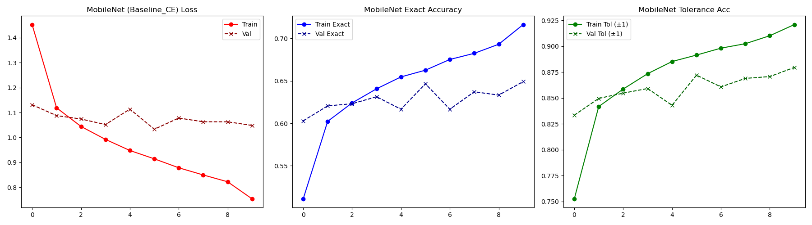
- 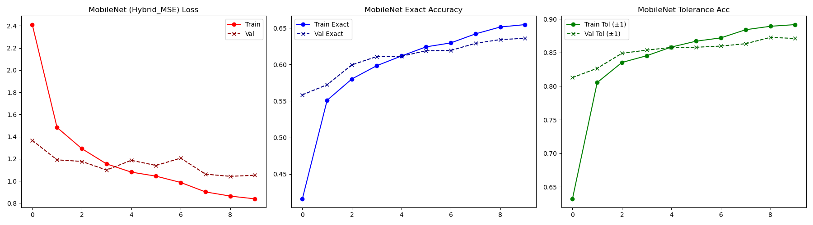
- 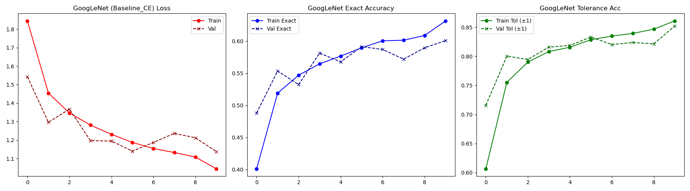
- 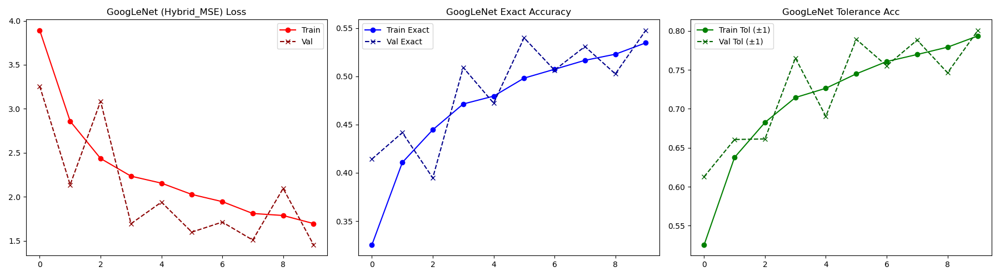
- 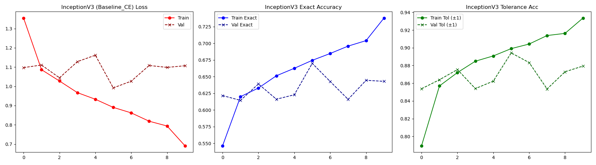
- 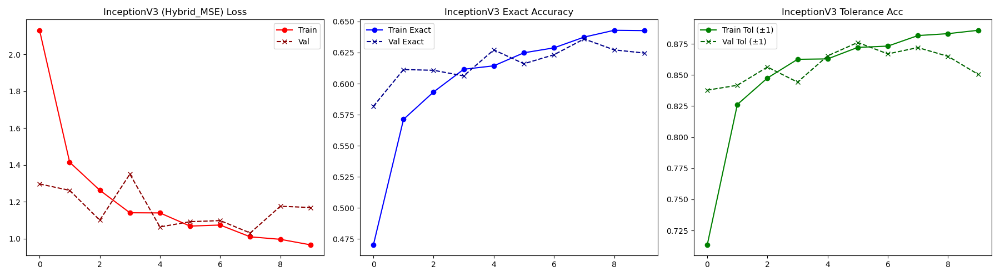
- 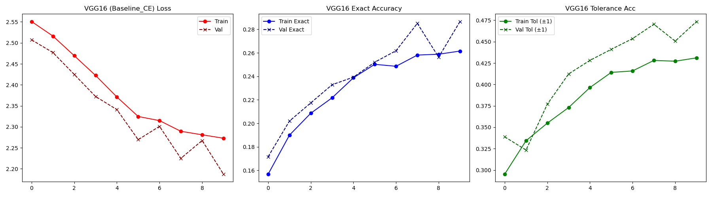
- 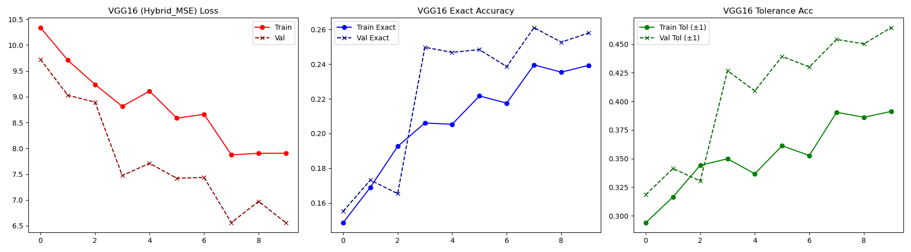
- 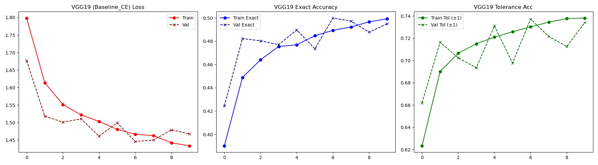
- 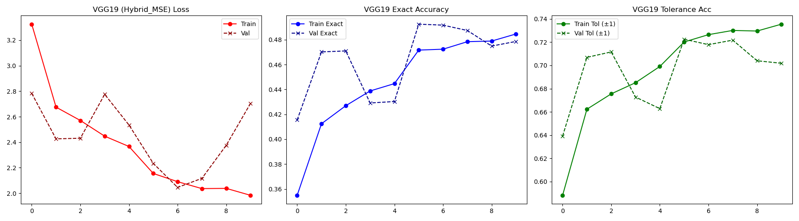

## 6. Conclusion
This ablation study shows that incorporating ordinal structure via an expected-index MSE penalty can provide strong regularization and reduce overfitting. However, the same penalty can introduce a challenging optimization trade-off: balancing exact-class likelihood against expected-index proximity can lead to conservative predictions and degraded exact accuracy, particularly in less robust architectures. In this dataset and setup, the best overall result is achieved by **InceptionV3 trained with standard Cross-Entropy**, suggesting that architectural capacity and representational strength can outweigh the benefits of additional ordinal constraints.

## Reproducibility Notes
- Checkpoints and plots live in `outputs/`.
- Summary metrics are generated by running:

```bash
python tools/summarize_tournament.py
```
